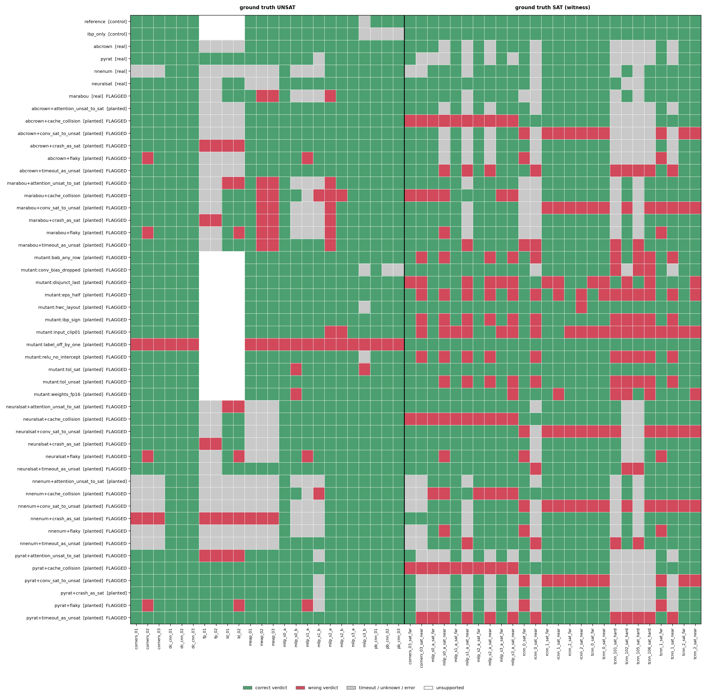
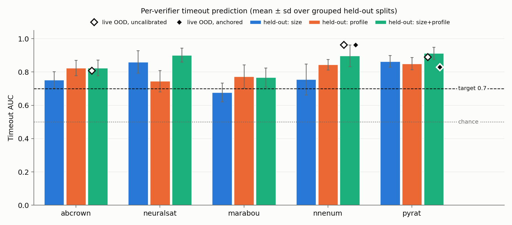

## AIQ Flow
To setup/run, complete the following:

### Benchmark Setup
```bash
git clone --recursive git@github.com:dtroxell19/VeriStressGT.git
cd VeriStressGT
git fetch origin
git checkout -b evaluation-card origin/evaluation-card
bash scripts/bootstrap.sh
conda activate VeriStressGT
```

### MAGNET Setup
```bash
pip install git+https://github.com/AIQ-Kitware/aiq-magnet.git

# Additional deps needed by Gurobi-based constructions
pip install sortedcontainers coloredlogs termcolor beartype gurobipy 
```

### α-β-CROWN Environment Variables
From root directory of repo:
```bash
export ABCROWN_VNNCOMP2024_DIR="$(pwd)/src/VeriStressGT/verifiers/alpha-beta-CROWN"
export ABCROWN_CONDA_ENV="alpha-beta-crown"
```

### Evaluation cards

| Card | Thrust | Metric |
|------|--------|--------|
| `cards/thrust1_soundness.yaml` | 1 (primary) | Buggy verifiers caught and scoring accuracy, ground-truth labels vs. majority vote |
| `cards/thrust2_timeout_prediction.yaml` | 2 | Per-verifier timeout-prediction AUC (target >= 0.7), held-out and live out-of-distribution |
| `cards/evaluation.yaml` | 2 (supporting) | Mini sweep: per-verifier correctness + per-component timeout AUC |

## Thrust 1: bug detection with ground-truth labels

```bash
magnet evaluate cards/thrust1_soundness.yaml
```

**Benchmark (`thrust1_bench/`, pre-built and committed).** Built from
`src/VeriStressGT/configs/thrust1.yaml` plus `python -m VeriStressGT.soundness.ground_truth`
(pass `--rebuild` to the runner to regenerate):

- 24 **UNSAT** instances, labelled by the constructors' analytic certificates (MILP exact radius,
  MEAP, corners, paired-bias CNN, contractive CNN, linear / softmax attention). This includes
  near-boundary MILP radii (eps = 0.999 r\*, 0.9999 r\*).
- 26 **SAT** instances, each shipping a concrete counterexample (`witness.json`) whose margin is
  negative in both float64 and onnxruntime float32, so no verifier has to be trusted for these
  labels. They are "twins" of robust networks with the radius scaled just past (`_sat_near`) or
  well past (`_sat_far`) the robustness threshold. MEAP and paired-bias networks are robust at
  every radius, so small random CNNs (`rcnn_*`, `tcnn_*`) supply the CNN counterexamples.
  Four of them (`tcnn_*_sat_hard`) sit so close to the threshold that PGD cannot find the
  counterexample but exact MILP can, so bugs in a verifier's proof procedure cannot hide behind a
  successful attack.

Without SAT instances, a verifier that always answers "robust" would score perfectly. They are
what exposes false UNSAT claims, the dangerous direction.

**Verifier pool.**

| Role | Verifiers |
|------|-----------|
| Sound controls | `reference` (in-house: PGD attack, then CROWN bounds, then exact MILP via scipy/HiGHS or ReLU-split BaB), `ibp_only` |
| Planted, tier (b) | 12 mutants of the reference with one injected bug each. Bound computation: `ibp_sign`, `relu_no_intercept`, `conv_bias_dropped`. Numerics: `tol_unsat`, `tol_sat`, `weights_fp16` (verifies a half-precision copy of the network). Search logic: `disjunct_last` (the Appendix D bug), `bab_any_row` (prunes a sub-domain once any disjunct is proved). Input/spec handling: `input_clip01`, `eps_half`, `hwc_layout` (reads a CHW image box as HWC), `label_off_by_one` |
| Real | `abcrown`, `pyrat`, `nnenum` (each skipped if not installed) |
| Planted, tier (a) | 6 output-level faults on each real verifier: `timeout_as_unsat`, `crash_as_sat` (the rebuttal-era parser bug), `conv_sat_to_unsat`, `attention_unsat_to_sat`, `cache_collision` (results cached by network file, ignoring the spec), `flaky` (nondeterministic flips on ~15% of instances) |

Bug descriptions and the failure classes they model are in `src/VeriStressGT/soundness/bugs.py`.

**Scoring.** A verifier is flagged when any SAT/UNSAT verdict contradicts the label;
timeouts and errors never flag. The same verdicts are scored three ways:

- `ground_truth`: the benchmark labels.
- `majority_one_buggy`: VNN-COMP-style majority vote over one planted verifier plus every
  honest verifier. Ties are unresolved; an instance nobody decides is assumed robust.
- `majority_full`: majority vote over the whole pool.

**Claim.** Ground truth flags at least `detection_threshold` (0.75) of the planted verifiers and
flags no sound control.

For planted verifiers, a flag counts only on instances where the planted bug changed the verdict
of the verifier it was derived from. Disagreements it merely inherits from that verifier are listed
separately as `gt_inherited`. Detection rates count only *exercised* planted bugs, meaning ones
that changed at least one verdict. A fault that never fires (for example a crash handler on a
verifier that never crashed) gives the benchmark nothing to catch and is listed as `not_exercised`.

The real verifiers run with counterexample search enabled (`configs/abcrown_thrust1.yaml` sets
`pgd_order: before`, and pyrat gets `--check both --attack pgd`). With the repo's default settings
both only try to prove UNSAT and never report SAT.

**Outputs** (next to `results.json`): `thrust1_verifiers.csv` (per-verifier flags),
`thrust1_evidence.json` (the instances that expose each flag), `thrust1_verdict_matrix.png`
(verifier × instance, correct / wrong / undecided).

### Sample run results

**Machine:** MacBook Pro (Apple Silicon), CPU only. **Config:** card defaults (60 s timeout,
4 parallel in-house jobs, 2 parallel real-verifier jobs, abcrown + pyrat + nnenum). The full card
run takes about 30 min.

Benchmark: 50 instances (24 UNSAT, 26 SAT, including 4 attack-hard tiny-CNN SAT instances where
PGD fails and only a completed proof procedure decides the instance).

**1. Buggy verifiers caught** (30 planted; 3 never exercised, so rates are out of 27)

| Labels used for scoring | Caught | Sound verifiers flagged |
|---|---|---|
| Ground truth | **27/27 (100%)** | none |
| Majority vote, one buggy verifier in the pool | 25/27 (93%) | none |
| Majority vote, full pool | 26/27 (96%) | **3**: `reference`, `ibp_only`, and the real `nnenum` |

**2. Scoring accuracy** (each of the 1,429 definitive verdicts across all verifiers is one judgment)

| Labels used for scoring | Correctly scored | Wrongful accusations | Wrongful acquittals | Unscored (ties) |
|---|---|---|---|---|
| Ground truth | **1429/1429 (100%)** | 0 | 0 | 0 |
| Majority vote, one buggy verifier in the pool | 1416/1429 (99.1%) | 0 | 0 | 13 |
| Majority vote, full pool | 1352/1429 (94.6%) | 33 | 44 | 0 |

A wrongful accusation calls a correct verdict wrong; a wrongful acquittal calls a wrong verdict
correct. Ground-truth SAT labels are re-certified from their witnesses on every run, so the 100%
is checked, not assumed.

- **Not exercised:** `pyrat+crash_as_sat` (pyrat never crashed), and
  `abcrown+attention_unsat_to_sat` / `nnenum+attention_unsat_to_sat` (neither verifier produced an
  UNSAT on an attention model to flip). These faults never changed a verdict.
- **Hard-to-expose bugs:** `mutant:conv_bias_dropped` and `mutant:weights_fp16` only produce wrong
  answers when the attack fails and the proof procedure decides, which happens on the attack-hard
  CNN instances. `mutant:hwc_layout` goes wrong on a single instance (`rcnn_2_sat_near`), the only
  multi-channel SAT instance whose scrambled box excludes every counterexample.
- **Majority vote, one buggy verifier:** it misses `abcrown+crash_as_sat` and
  `pyrat+attention_unsat_to_sat`. Their false SATs land on attention instances where the only
  other decisive verifier is the real tool that supports them, so the vote ties and nobody is
  flagged.
- **Majority vote, full pool:** the planted false-UNSAT verdicts outvote the truth on near-threshold
  SAT instances. Three sound verifiers are flagged for correct answers, including real nnenum, and
  `mutant:conv_bias_dropped` goes undetected.
- **pyrat false UNSAT (prove-only mode):** with counterexample search off, unmodified pyrat
  (`con_z`, torch float32) reported `tcnn_2_sat_near` as robust. Exact rational arithmetic on the
  model's weights confirms the stored witness lies in the box with margin -2.99e-6. With the attack
  enabled, pyrat finds the counterexample first.



## Thrust 2: per-verifier timeout prediction

```bash
magnet evaluate cards/thrust2_timeout_prediction.yaml
```

One predictor per verifier: elastic-net logistic regression on network size/type features plus
the five Difficulty-Profile components (`src/VeriStressGT/prediction/`).

1. **Recorded, held-out (primary).** The training data is the paper's server runs
   (`src/VeriStressGT/prediction/data/training_rows.csv`): 345 instances (225 synthetic, 120
   VNN-COMP mnist_fc / oval21) × abcrown, neuralsat, marabou, nnenum, pyrat. Every split is grouped
   by network, so no network is on both sides; this matters because VNN-COMP reuses 6 networks
   across 120 properties. Results are the mean over 10 grouped splits. Labels use a 120 s horizon
   (timed out, or solved only after 120 s), matching the live runs.
2. **Live out-of-distribution (reported).** `thrust2_ood_bench/` holds 30 fresh networks with
   seeds and parameters outside the training runs. The card computes their features on the fly,
   runs abcrown, pyrat and nnenum at a 120 s timeout, and scores predictors fitted on all recorded
   data.
3. **Environment diagnostic.** For each live verifier, the card also re-runs 12 recorded anchor
   instances from the hard end of its recorded runtimes. It fits local_s = overhead + slope[arch] ×
   recorded_s, which shows how far that verifier's speed has shifted from the recording environment.
   An anchored model is also reported, but is exploratory: with this few anchors it was not
   reliably better than the uncalibrated one.

**Claim.** Every verifier's mean held-out AUC is >= 0.7. Per the eval plan, this is not aligned
to the BAA's 95% goal.

Features are computed exactly as for the training table: size/type from the ONNX graph, and the
profile via `estimate_profile(..., atau_n_samples=600)`, with `a_tau` as the log-count of distinct
local fingerprints (paper Eq. 14). `tests/test_prediction.py` checks the recomputed features
against the table.

**Run it on an awake, plugged-in machine.** Runtimes are measured with a monotonic clock, so a
sleeping laptop does not inflate them, but a suspended run does not progress either.

### Sample run results

**Machine:** MacBook Pro (Apple Silicon), CPU only, plugged in and awake. **Config:** card
defaults (120 s horizon). Full run about 35 min.

| Verifier | Held-out AUC, size + profile | Size only | Profile only | Live OOD AUC (timeouts) |
|---|---|---|---|---|
| abcrown | **0.825** ± 0.047 | 0.753 | 0.825 | **0.808** (4/30) |
| neuralsat | **0.902** ± 0.042 | 0.861 | 0.745 | not run live |
| marabou | **0.768** ± 0.057 | 0.677 | 0.774 | not run live |
| nnenum | **0.898** ± 0.065 | 0.756 | 0.844 | **0.963** (6/15; nnenum errors on MEAP and attention) |
| pyrat | **0.913** ± 0.035 | 0.864 | 0.851 | **0.890** (10/30) |

- All five verifiers clear 0.7 on held-out networks, and the predictors transfer to fresh networks
  run live on a different machine (0.81-0.96).
- The anchors show how much the environment matters. Local abcrown solves the server's attention
  anchors (142-154 s there) in 7-8 s, about 20× faster, and too fast for the slope to be
  identifiable. pyrat's slope is about 0.5-1.2 and nnenum's about 0.6-1.0. An earlier 60 s run gave
  abcrown a live AUC of about 0.67. That run was not clean (leftover verifier processes overloaded
  the machine), but the direction is expected: at 60 s the server labels call every attention model
  a timeout. At 120 s the predictor is less exposed to this speed shift.
- The anchored models were not better (pyrat 0.830 vs 0.890 uncalibrated; nnenum unchanged), so
  the uncalibrated live AUC is the headline number.



## Mini sweep (supporting card)

### Run
```bash
magnet evaluate cards/evaluation.yaml
```

### Expected Results

**Output files** written alongside `results.json`:

| File | Description |
|------|-------------|
| `mini_sweep_summary.csv` | Per-verifier solved/total counts and correct fraction |
| `construction_heatmap.png` | Solved/total per construction × verifier, with avg wall time |
| `timeout_auc_heatmap.png` | Timeout AUC per difficulty component × verifier |
| `timeout_auc.csv` | Numeric timeout AUC values |

**1. Correctness invariant:** Every instance is UNSAT by construction (provably robust). No verifier should ever return SAT — a SAT result indicates a soundness error in that verifier. Some verifiers will timeout or return error (i.e. unsupported) results.

**2. Timeout AUC Values Typically Above 0.5:** For each (component, verifier) pair, timeout AUC is the probability that a randomly chosen timed-out instance has a higher component value than a randomly chosen solved instance (AUROC of the component as a timeout predictor). A value > 0.5 means harder instances — as measured by that component — are more likely to cause a timeout, which is the expected direction. Values near 0.5 indicate the component doesn't predict difficulty for that verifier. We expect the majority of verifier, component combinations to have a value over 0.5.

---

### Sample Run Results

**Machine:** MacBook Pro, Apple Silicon, 8 GB RAM, macOS Sonoma 14.7.5  
**Config:** 50 instances × {pyrat, nnenum}, 60s timeout per instance

**Verifier summary:**

| Verifier | UNSAT | Timeout | Error | SAT |
|----------|------:|--------:|------:|----:|
| alpha,beta-crown    | 49   | 1      | 0     | 0   |
| pyrat    | 45    | 4       | 1     | 0   |
| nnenum   | 13     | 10       | 27    | 0   |

No verifier returned SAT. nnenum errors are structural (unsupported op types on meap, corners, and attention constructions) rather than difficulty-related. pyrat timeouts occur on the hardest `pb_cnn` (large `num_pairs`) and `milp`/`meap` instances at the top of the difficulty range.

**Timeout AUC heatmap** (pyrat + nnenum, 60s timeout):


